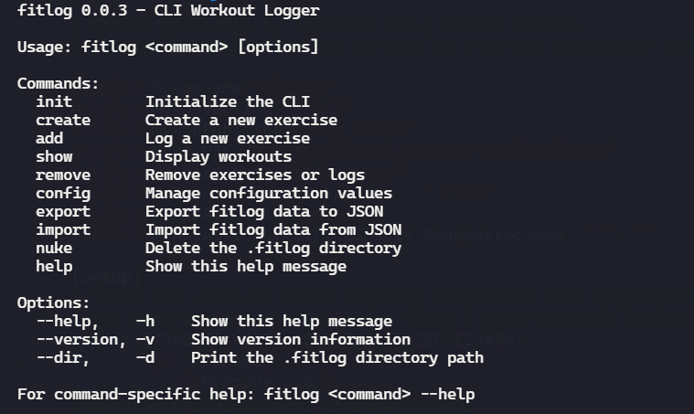

# 📋 fitlog



[](https://github.com/yourusername/fitlog)
[](https://opensource.org/licenses/MIT)
[](https://github.com/Jay-Karia/fitlog)

CLI Workout Logger

## Features

- Track exercises with customizable types (weight, time, bodyweight)
- Log workouts with sets, reps, weight, time, and notes
- View workout history by date range or specific criteria
- Use shortcuts for quick and efficient workout logging
- Remove or update exercise and workout entries
- Display workout data in clean, tabular format
- Configuration management
- Import and export your fitlog data

## Quick Start

```bash
# Add your first exercise
fitlog create "Push-ups" pu --type body

# Log a workout
fitlog workout add pu --reps 20 --sets 3

# View your workout history
fitlog show workout --all

# Get help for any command
fitlog --help
```

## Documentation

Visit the [fitlog wiki](https://github.com/Jay-Karia/fitlog/wiki) for detailed guides and references.

## Manual Installation

### Prerequisites

- C compiler (GCC 9.0+ or Clang 10.0+)
- Make utility
- Git (for source installation)

```bash
git clone https://github.com/Jay-Karia/fitlog.git
cd fitlog
make
```

### Build locally

```bash
make
./dist/fitlog
```

### Install from executable

Download and run the latest `fitlog - Setup {version}.exe` from the [releases page](https://github.com/Jay-Karia/fitlog/releases).

## Support

If you find fitlog helpful, please consider starring the repository! ⭐
